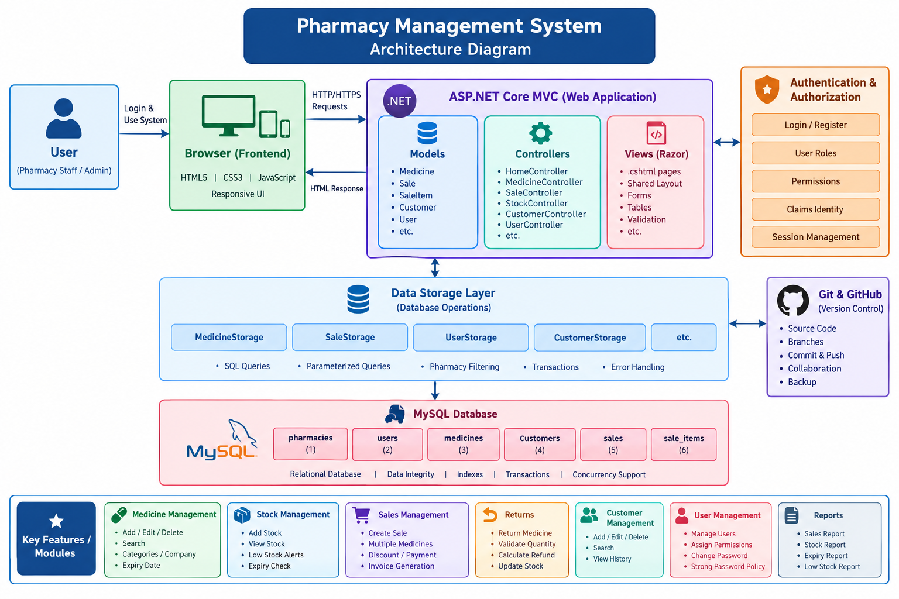

# 💊 Pharmacy Management System

A web-based Pharmacy Management System developed using **C#, ASP.NET Core MVC, Razor, JavaScript, CSS, and MySQL**.

The system is designed to help pharmacies manage medicines, inventory, sales, returns, customers, users, permissions, and reports.

---

## 🏗️ System Architecture

The Pharmacy Management System follows an **ASP.NET Core MVC architecture** with a separate data storage layer and MySQL database.



---

## 🚀 Technologies Used

- C#
- .NET 10
- ASP.NET Core MVC
- Razor / CSHTML
- HTML5
- CSS3
- JavaScript
- MySQL
- SQL
- Git
- GitHub

---

## 📦 Main Modules

### 💊 Medicine Management
- Add medicine
- View medicines
- Search medicines
- Update medicine
- Delete medicine

### 📦 Stock Management
- Add stock
- View stock
- Low-stock checking
- Expiry checking

### 💰 Sales Management
- Create sales
- Generate invoices
- Sales history
- Medicine returns
- Refund calculation

### 👥 Customer Management
- Add customers
- View customers
- Update customers
- Delete customers

### 👤 User Management
- User registration
- Login
- User management
- Roles and permissions
- Password management

### 📊 Reports
- Sales reports
- Inventory information
- Stock information

---

## 🔐 Security

The system includes:

- Authentication
- Authorization
- User permissions
- Claims-based identity
- Anti-forgery protection
- Parameterized SQL queries
- Server-side validation
- Pharmacy-level data isolation

---

## 🏥 Multi-Pharmacy Support

Each pharmacy has its own data.

Records are associated with a `PharmacyId`, ensuring that one pharmacy cannot access another pharmacy's medicines, customers, sales, or users.

---

## 🔎 Medicine Search

The system uses **server-side medicine searching** instead of loading thousands of medicines into a dropdown.

This allows the system to efficiently handle pharmacies with **1000+ medicines**.

Search results are limited and filtered by pharmacy.

---

## 💾 Database

The system uses **MySQL** for persistent data storage.

Main tables include:

- `pharmacies`
- `users`
- `medicines`
- `customers`
- `sales`
- `sale_items`

---

## 🧱 Architecture

```text
User
  ↓
Browser
  ↓
HTML / CSS / JavaScript
  ↓
ASP.NET Core MVC
  ├── Controllers
  ├── Models
  └── Views
        ↓
   DataStorage Layer
        ↓
      MySQL